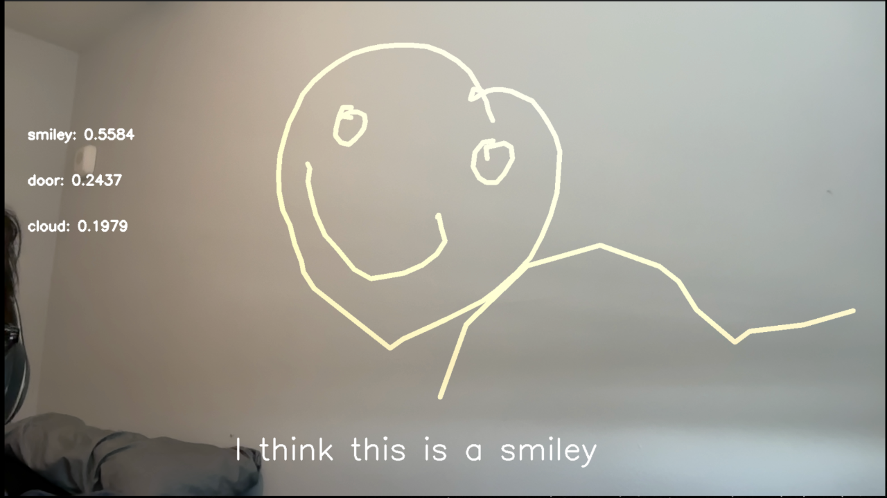

---

# 🖐️ Hand Gesture Emoji Detector

A fun **real-time hand gesture drawing emoji recognition** project! Use your finger (or hand) in front of a webcam to *draw shapes in the air* and have the model classify them into emojis.

You literally draw with your hand, and the model predicts the emoji you intended!

---

## 🚀 Features

* 📸 **Live webcam interaction** — draw in the air with your hand
* 🤖 **Gesture recognition model** trained to detect hand-drawn emoji shapes
* 📈 Trains and evaluates a custom model
* 📊 Includes Jupyter notebooks for training and experimenting

---

## 🧠 How It Works

1. **Hand tracking & drawing**
   The user draws in front of the webcam using finger gestures.

2. **Gesture processing**
   Key points or motion patterns are extracted for each gesture.

3. **Classification**
   A model is trained to recognize which emoji the user intended based on the drawing.

---

## 📁 Repository Contents

| File / Folder                  | Description                                            |
| ------------------------------ | ------------------------------------------------------ |
| `main.ipynb`                   | Core notebook for running the detection and demo logic |
| `emoji_Tranfer_Learning.ipynb` | Notebook for training a transfer learning model        |
| `myModel.keras`                | Pre-trained model file                                 |

---

## 🛠️ Getting Started

### 🧩 Prerequisites

Make sure you have:

* Python 3.7+ installed
* A webcam for live gesture capture
* Jupyter Notebook or Jupyter Lab (optional, for exploring notebooks)

---

### 📦 Installation

Clone the repo:

```bash
git clone https://github.com/Guri080/hand-gesture-emoji-detector.git
cd hand-gesture-emoji-detector
```

---

## 🖥️ Usage

### 🧠 Run the Main Notebook

Open and run:

```bash
jupyter notebook main.ipynb
```

→ Start your webcam and follow the instructions inside the notebook to draw gestures and see emoji predictions in real time.

### 🏋️ Train Your Own Model

Use the transfer learning notebook:

```bash
jupyter notebook emoji_Tranfer_Learning.ipynb
```

This is where you can experiment with collecting new samples, training, and improving accuracy.

---

## 📸 Example Screenshots


---
